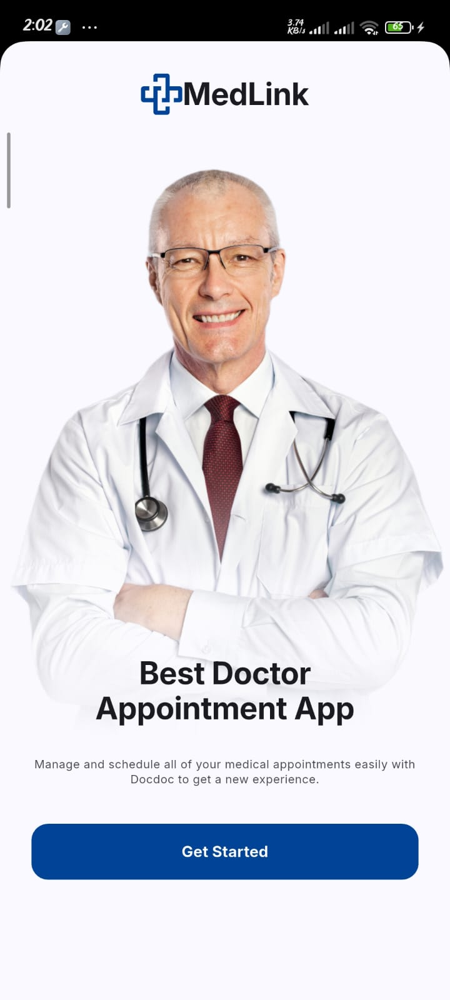
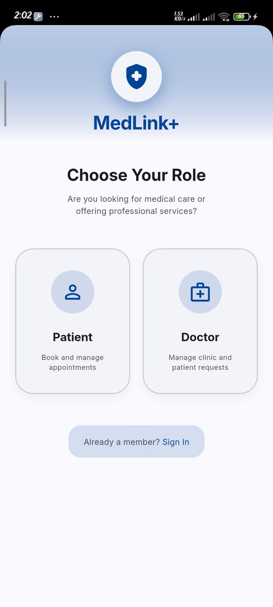
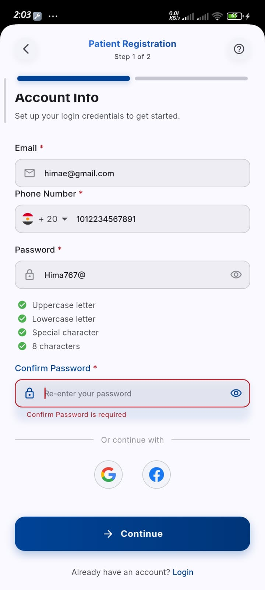
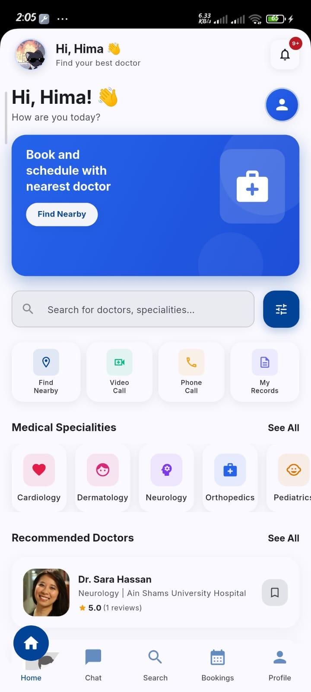
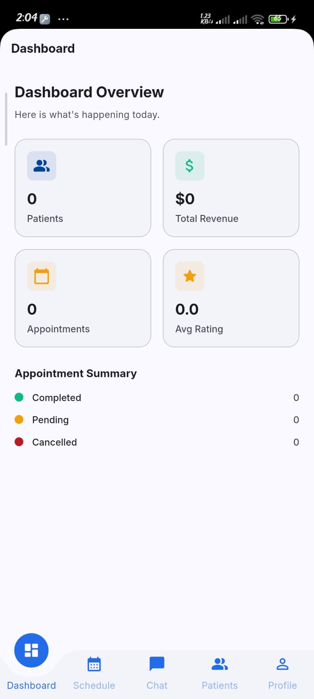
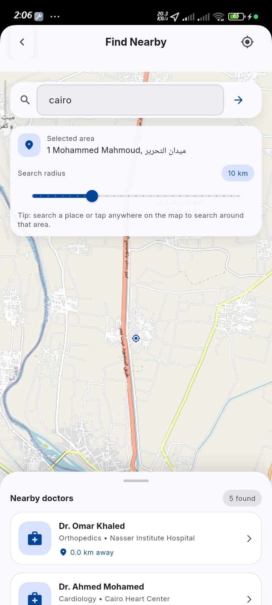
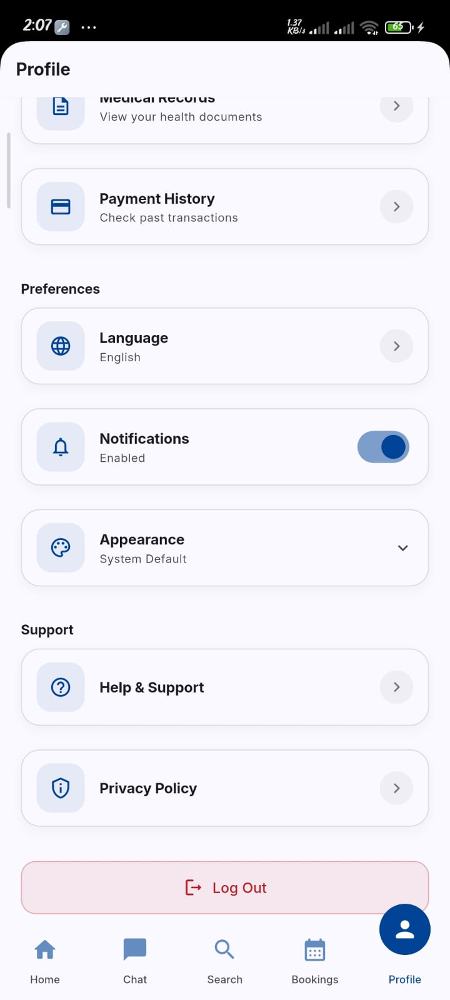
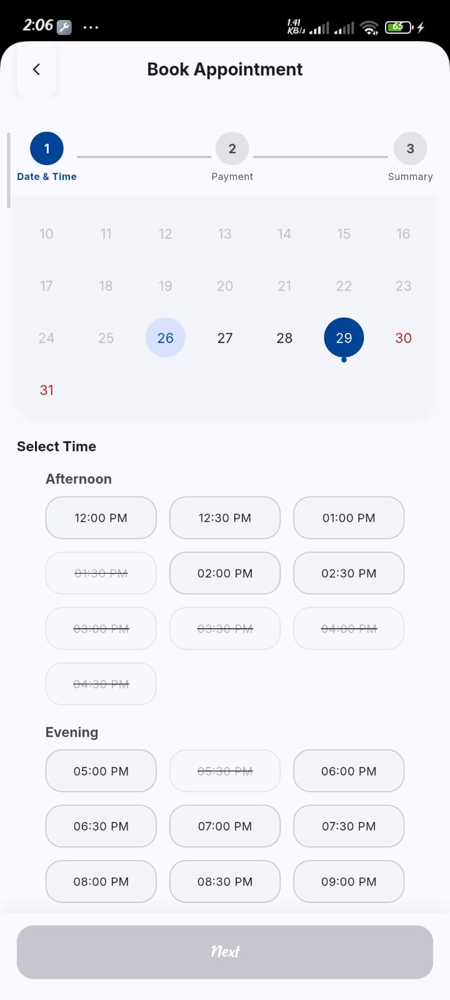

# 🩺 MedLink+


MedLink+ is an AI-powered healthcare platform that connects patients with doctors through a seamless and intelligent experience. The application enables appointment booking, real-time communication, secure payments, location-based doctor discovery, and AI-assisted healthcare support.

Built as a **Graduation Project**, MedLink+ aims to provide a scalable and modern healthcare solution suitable for clinics and medical centers.

---

# ✨ Features

## 👨‍⚕️ For Patients

### 🔍 Smart Doctor Search

* Search doctors by specialization.
* View doctor ratings and recommendations.
* Find nearby doctors using OpenStreetMap (OSM).
* Interactive map experience powered by OSM.

### 📅 Appointment Booking

* View available schedules.
* Book appointments instantly.
* Manage upcoming and previous appointments.

### 💳 Secure Payments

Integrated with **Paymob** supporting:

* Online card payments.
* Mobile wallets.
* Cash payments at the clinic.

### 💬 Real-Time Chat

* One-to-one messaging with doctors.
* Real-time communication using SignalR.

### 🤖 AI Assistant

* AI-powered chatbot.
* Answers basic medical questions.
* Provides healthcare guidance and recommendations.

### 📂 Medical Records

* Upload medical files and reports.
* Manage medical history.
* Access patient records securely.

### 🔔 Notifications

* Push notifications with Firebase Cloud Messaging.
* Local notifications support.
* Appointment reminders.

---

## 👨‍⚕️ For Doctors

### 📊 Doctor Dashboard

* View statistics and appointments.
* Monitor daily activities.

### 📅 Schedule Management

* Manage pending appointments.
* View completed appointments.
* Organize availability and working hours.

### 👤 Profile Management

* Update profile information.
* Manage specializations.
* Control visibility settings.

---

# 📍 Location Services

MedLink+ utilizes **OpenStreetMap (OSM)** with `flutter_osm_plugin` to:

* Display interactive maps.
* Detect user location.
* Find nearby doctors.
* Enhance accessibility for patients.

---

# 🏗 Architecture

The project follows **Clean Architecture** with a **Feature-First Structure**.

## Core Layer

Shared infrastructure:

* Dependency Injection
* Routing
* Themes
* Networking
* Error Handling
* Logging

## Feature Modules

The application consists of multiple independent features such as:

* Authentication
* Home
* Doctors
* Appointments
* Chat
* Payments
* Notifications
* AI Assistant
* Medical Records
* Profile

Each feature contains:

1. **Data Layer**

   * Models
   * Datasources
   * Repository Implementations

2. **Domain Layer**

   * Entities
   * Use Cases
   * Repository Contracts

3. **Logic Layer**

   * Cubit / Bloc State Management

4. **Presentation Layer**

   * Views
   * Widgets

---

# 🛠 Tech Stack

## Frontend

* Flutter
* Dart

## State Management

* Bloc / Cubit

## Routing

* go_router

## Dependency Injection

* GetIt
  
## Networking

* Dio

## Real-Time Communication

* SignalR for mobile
* WebSocker for web

## Payment Gateway

* Paymob

## Maps & Location

* OpenStreetMap (OSM)
* flutter_osm_plugin
* geolocator

## Notifications

* Firebase Messaging
* flutter_local_notifications

## Storage
*hive
* flutter_secure_storage
* shared_preferences

## Monitoring

* Sentry
* Logger

## Localization

* English 🇺🇸
* Arabic 🇪🇬

---

# 🔐 Authentication

MedLink+ uses a secure JWT-based authentication system with hybrid refresh:

### Proactive Refresh

The token expiration is checked locally during app launch and refreshed automatically if needed.

### Reactive Refresh

A custom Dio interceptor handles `401 Unauthorized` responses, refreshes the token, and retries requests transparently.

---

# 📸 Screenshots

<p align="center">
  
  
  
</p>

<p align="center">
  
  
  
</p>

<p align="center">
  
  
  
</p>

---

# 🚀 Getting Started

## Prerequisites

* Flutter SDK
* Android Studio / VS Code
* Android Emulator or Physical Device

## Setup

### Clone the repository

```bash
git clone https://github.com/your_username/medlink.git
```

### Install dependencies

```bash
flutter pub get
```

### Configure environment variables

Create:

```text
assets/envs/.env
```

Example:

```env
API_BASE_URL=
PAYMOB_API_KEY=
PAYMOB_INTEGRATION_ID=
```

### Run the application

```bash
flutter run
```

---

# 🔮 Future Enhancements

* Video consultations.
* Voice calls.
* AI symptom checker.
* E-prescriptions.
* Electronic Health Records (EHR).
* Medical reports and analytics.
* Wearable device integration.
* AI-powered doctor recommendations.


---

# 📄 License

This project is developed for educational and research purposes.
